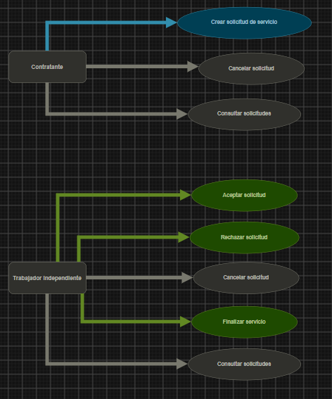

# Documento de Requerimientos - Dominio Service

Proyecto: OficioYa
Squad: 4
Dominio: Service Domain
Product Owner: Juan Jose Rivera
Analista Funcional: Santiago Gomez
Lider Tecnico: Juan Esteban Laverde
Equipo de Desarrollo: Brian Fierro, Diego Mesa

## 1. Creacion de Solicitudes
* REQ-SRV-001: El sistema debe permitir al contratante crear una solicitud de servicio indicando descripcion en texto, fotografia, zona (barrio y direccion exacta), fecha y hora.
* REQ-SRV-002: El sistema debe permitir al contratante enviar la misma solicitud a un solo trabajador o a multiples trabajadores de la zona de forma simultanea.
* REQ-SRV-003: Si una solicitud se envia a multiples trabajadores, el sistema debe crearla como solicitudes independientes para cada trabajador.

## 2. Gestion y Estados de la Solicitud
* REQ-SRV-004: El sistema debe permitir al trabajador aceptar o rechazar una solicitud entrante en un plazo maximo de 30 minutos.
* REQ-SRV-005: Si el trabajador no responde en 30 minutos, el sistema debe cambiar automaticamente el estado de la solicitud a Expirada.
* REQ-SRV-006: Si multiples trabajadores aceptan una solicitud enviada en grupo, el sistema debe solicitar al contratante que cancele las que no desea tomar.
* REQ-SRV-007: El sistema debe gestionar las solicitudes bajo los siguientes estados exactos: Pendiente, Aceptada, Cancelada, Rechazada, Cumplida, Expirada y Eliminada.
* REQ-SRV-008: Las solicitudes eliminadas no deben borrarse fisicamente de la base de datos (eliminacion logica).

## 3. Cancelaciones y Penalidades
* REQ-SRV-009: El sistema debe permitir al contratante cancelar una solicitud en cualquier momento si esta aun no ha sido aceptada.
* REQ-SRV-010: El sistema debe permitir a ambas partes (contratante y trabajador) cancelar una solicitud aceptada hasta 24 horas antes de la hora pactada sin penalizacion.
* REQ-SRV-011: Si el contratante cancela con menos de 24 horas de anticipacion, el sistema debe bloquearlo para realizar nuevas solicitudes a ese mismo trabajador durante una semana.

## 4. Consultas
* REQ-SRV-012: El sistema debe permitir al contratante y al trabajador consultar el listado de sus solicitudes activas e historicas.

## 5. Diagramas de Casos de Uso
(Los diagramas se elaboraron sin mockups de interfaz grafica, cumpliendo las restricciones del Sprint 1).

